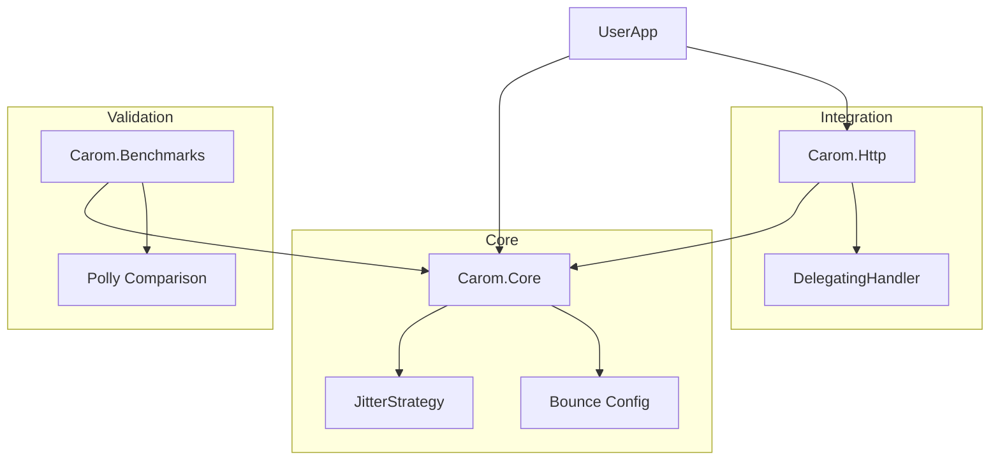

# Carom 🎱

**Physics-based, zero-dependency resilience for .NET.**

Carom is a high-performance, opinionated resilience library built on the "calculated strike" metaphor of billiards. Unlike Polly's complex policy builders, Carom uses simple static methods and enforces **decorrelated jitter** by default to prevent Thundering Herd issues.

[](https://opensource.org/licenses/MPL-2.0)
[](https://www.nuget.org/packages/Carom)

---

## 🏛 Architecture & Project Structure

Carom is designed to be tiny, fast, and modular. It follows the **"Baryo" Pattern**: a lean core with zero dependencies.



### Projects:
- **`src/Carom`**: The Core Engine. Zero dependencies. Implements the physics of retries.
- **`src/Carom.Http`**: HTTP Integration. Specialized handler for transient status codes (503, 408, 429, etc.).
- **`benchmarks/Carom.Benchmarks`**: Performance validation. Proof of zero startup overhead.

---

## 🚀 Quick Start

### Basic Shot
Take a "Shot". If it misses (throws), it caroms off the error and tries again.

```csharp
using Carom;

// Default: 3 retries, decorrelated jitter, 100ms base delay
var result = Carom.Shot(() => ExternalService.Process());
```

### Async Shot
```csharp
var data = await Carom.ShotAsync(() => httpClient.GetStringAsync(url));
```

### Advanced Configuration (The "Bounce")
Configure exactly how you want to redirect the energy.

```csharp
var config = Bounce.Times(5)
    .WithDelay(TimeSpan.FromSeconds(1))
    .When(ex => ex is TimeoutException);

await Carom.ShotAsync(() => Task.Run(() => ...), config);
```

---

## 🧪 Philosophy: Calculated Resilience

1.  **Chaos is Default**: Jitter is not an "advanced setting." It's mandatory for healthy distributed systems. In Carom, you have to explicitly `WithoutJitter()` to be unsafe.
2.  **Zero Allocation**: A retry loop is just a loop. Carom avoids the `new PolicyBuilder().Handle().WaitAndRetry()` allocation chain.
3.  **Physics-Based Delay**: Uses **Decorrelated Jitter** (AWS standard).
    - `next_delay = rand(base_delay, prev_delay * 3)`
    - This ensures traffic is distributed naturally even when thousands of clients retry at once.

---

## 📊 Benchmarks

Carom is designed for serverless and performance-critical paths where every millisecond of startup counts.

| Feature              | Carom                  | Polly                  |
| :------------------- | :--------------------- | :--------------------- |
| **Startup Overhead** | **0ms** (Static)       | High (Policy Builders) |
| **Default Jitter**   | **Safe** (On)          | Unsafe (Off)           |
| **Dependencies**     | **Zero**               | Multiple               |
| **Mental Model**     | Billiards (Hit/Bounce) | Rules Engine           |

---

## 📄 License

This project is licensed under the **Mozilla Public License 2.0 (MPL-2.0)** - see the [LICENSE](LICENSE) file for details.

© 2025 [Baryo.Dev](https://baryo.dev)
