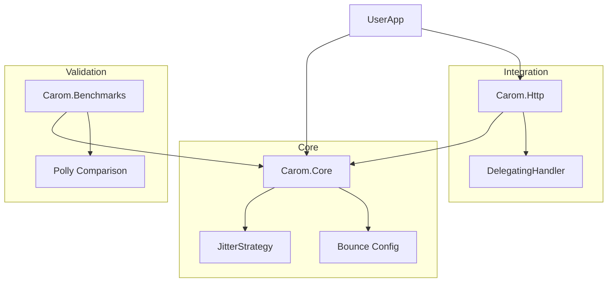

# Carom 🎱

**Physics-based, zero-dependency resilience for .NET.**

Carom is a high-performance, opinionated resilience library built on the "calculated strike" metaphor of billiards. Unlike Polly's complex policy builders, Carom uses simple static methods and enforces **decorrelated jitter** by default to prevent Thundering Herd issues.

[](https://opensource.org/licenses/MPL-2.0)
[](https://www.nuget.org/packages/Carom)

---

## 🏛 Architecture & Project Structure

Carom is designed to be tiny, fast, and modular. It follows the **"Baryo" Pattern**: a lean core with zero dependencies.



### Projects:
- **`src/Carom`**: The Core Engine. Zero dependencies. Implements the physics of retries.
- **`src/Carom.Http`**: HTTP Integration. Specialized handler for transient status codes (503, 408, 429, etc.).
- **`benchmarks/Carom.Benchmarks`**: Performance validation. Proof of zero startup overhead.

---

## 🚀 Why Carom? (The "Sharp Shooter" Edge)

Most resilience libraries are "Rules Engines." Carom is a **precision tool**.

1.  **Zero-Dependency**: We don't bring 5 other NuGet packages with us. Carom is a single, tiny DLL.
2.  **Instant-On**: No object-graph builders. Zero startup overhead. Ideal for **Serverless (Lambda/Azure Functions)**.
3.  **Safe by Default**: Jitter is not an option; it's the law. We protect your backend from "Thundering Herds" automatically.

---

## 🚀 Quick Start

### Basic Shot
Take a "Shot". If it misses (throws), it caroms off the error and tries again.

```csharp
using Carom;

// Default: 3 retries, decorrelated jitter, 100ms base delay
var result = Carom.Shot(() => ExternalService.Process());
```

### Async Shot
```csharp
var data = await Carom.ShotAsync(() => httpClient.GetStringAsync(url));
```

### Advanced Configuration (The "Bounce")
Configure exactly how you want to redirect the energy.

```csharp
var config = Bounce.Times(5)
    .WithDelay(TimeSpan.FromSeconds(1))
    .When(ex => ex is TimeoutException);

await Carom.ShotAsync(() => Task.Run(() => ...), config);
```

### Circuit Breaker ("Cushion")

Protect failing services with automatic circuit breaking (requires `Carom.Extensions`):

```csharp
using Carom.Extensions;

var cushion = Cushion.ForService("payment-api")
    .OpenAfter(failures: 5, within: 10)
    .HalfOpenAfter(TimeSpan.FromSeconds(30));

// With retry + circuit breaker
var result = await CaromCushionExtensions.ShotAsync(
    () => paymentApi.Charge(request),
    cushion);
```

**How it works**:
- Circuit **closes** (normal) when service is healthy
- Circuit **opens** after 5 failures in last 10 calls
- Circuit **half-opens** after 30 seconds to test recovery
- If test succeeds, circuit closes; if fails, reopens

### Fallback ("Safety Pocket")

Provide safe defaults when operations fail (requires `Carom.Extensions`):

```csharp
using Carom.Extensions;

// Simple fallback value
var config = await new Func<Task<AppConfig>>(
    () => configService.LoadAsync()
).PocketAsync(AppConfig.Default);

// Fallback with exception handling
var data = await new Func<Task<string>>(
    () => apiClient.FetchAsync()
).PocketAsync(ex => {
    logger.LogWarning(ex, "API failed, using cache");
    return cache.Get();
});

// Combine retry + fallback
var result = CaromFallbackExtensions.ShotWithPocket(
    () => externalService.Call(),
    fallback: "default-value",
    retries: 3);
```

### Timeout

Set a maximum duration for operations (including retries):

```csharp
// Simple timeout
var result = await Carom.ShotAsync(
    () => slowService.CallAsync(),
    retries: 3,
    timeout: TimeSpan.FromSeconds(10));

// With Bounce
var bounce = Bounce.Times(5)
    .WithDelay(TimeSpan.FromMilliseconds(500))
    .WithTimeout(TimeSpan.FromSeconds(30));

var data = await Carom.ShotAsync(
    () => apiClient.FetchAsync(),
    bounce);
```

**Note**: Timeout creates a `CancellationTokenSource` that cancels after the specified duration. Your code should observe the cancellation token for timeout to take effect.

### Bulkhead ("Compartment")

Isolate resources to prevent cascading failures (requires `Carom.Extensions`):

```csharp
using Carom.Extensions;

// Limit concurrent database connections
var dbCompartment = Compartment.ForResource("database")
    .WithMaxConcurrency(10)
    .Build();

var result = await CaromCompartmentExtensions.ShotAsync(
    () => database.QueryAsync(sql),
    dbCompartment);

// Compose with other patterns
var cushion = Cushion.ForService("db").OpenAfter(5, 10);
var result = await CaromCompartmentExtensions.ShotAsync(
    () => CaromCushionExtensions.ShotAsync(
        () => database.QueryAsync(sql),
        cushion),
    dbCompartment);
```

**How it works**:
- Uses `SemaphoreSlim` to limit concurrent executions
- Throws `CompartmentFullException` when limit exceeded
- Automatically releases slots after completion (even on exceptions)

### Rate Limiting ("Throttle")

Control the rate of operations to prevent overwhelming services (requires `Carom.Extensions`):

```csharp
using Carom.Extensions;

// Limit API calls to 100 per second
var apiThrottle = Throttle.ForService("external-api")
    .WithRate(100, TimeSpan.FromSeconds(1))
    .WithBurst(20)  // Allow bursts up to 20
    .Build();

var result = await CaromThrottleExtensions.ShotAsync(
    () => apiClient.CallAsync(),
    apiThrottle);
```

**How it works**:
- Uses token bucket algorithm for smooth rate limiting
- Lock-free implementation with `Interlocked` operations
- Throws `ThrottledException` when rate limit exceeded
- Tokens refill automatically over time

---

## 🚀 Deployment

Carom uses a manual, highly-controlled deployment process to ensure stability.

### Local Manual Publish
To publish from your local machine (requires `NUGET_API_KEY` environment variable):
```bash
# Dry run to verify versions and pack
./publish.sh 1.0.1 --dry-run

# Full publish (build, pack, and push)
./publish.sh 1.0.1 --push
```

### GitHub Actions (Manual Dispatch)
1. Go to the **Actions** tab in GitHub.
2. Select the **Publish to NuGet** workflow.
3. Click **Run workflow**, enter the version number, and click the button.

---

## 🧪 Philosophy: Calculated Resilience

1.  **Chaos is Default**: Jitter is not an "advanced setting." It's mandatory for healthy distributed systems. In Carom, you have to explicitly `WithoutJitter()` to be unsafe.
2.  **Zero Allocation**: A retry loop is just a loop. Carom avoids the `new PolicyBuilder().Handle().WaitAndRetry()` allocation chain.
3.  **Physics-Based Delay**: Uses **Decorrelated Jitter** (AWS standard).
    - `next_delay = rand(base_delay, prev_delay * 3)`
    - This ensures traffic is distributed naturally even when thousands of clients retry at once.

---

## 📊 Benchmarks vs. The Giant

Carom is designed to win where every millisecond of startup and every byte of memory counts.

| Feature              | Carom 🎱                | Polly 🛡️              |
| :------------------- | :--------------------- | :------------------- |
| **Startup Overhead** | **0ms (Static)**       | High (Object Graph)  |
| **Default Jitter**   | **Safe (On)**          | Unsafe (Off)         |
| **Dependencies**     | **Zero**               | Multiple             |
| **Package Size**     | **Tiny (<50KB)**       | Larger               |
| **Best For**         | Serverless / Libraries | Enterprise Monoliths |

---

## 🗺️ Phase 2 Roadmap: The Lean Evolution

We are committed to evolving Carom while strictly adhering to the **Baryo Dev** philosophy of zero dependencies and minimal allocations.

- 🟠 **The "Cushion" (Circuit Breaker)**: A high-performance, passive circuit breaker that protects your infrastructure without background thread overhead.
- 🟠 **The "Safety Pocket" (Fallback)**: Native support for fallback values and actions with zero extra allocations.
- 🟠 **Performance Guardrails**: Automated benchmarking in CI to ensure Carom remains the fastest resilience engine in the .NET ecosystem.

> [!NOTE]
> Have a suggestion for a lean feature? [Open an issue](https://github.com/BaryoDev/Carom/issues) and let us know.

---

## 📄 License

This project is licensed under the **Mozilla Public License 2.0 (MPL-2.0)** - see the [LICENSE](LICENSE) file for details.

© 2025 [Baryo.Dev](https://baryo.dev)
